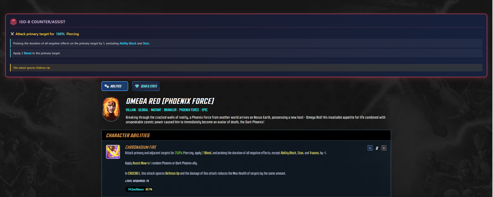

# MSF ISO-8 Counter/Assist Viewer

A Chrome extension that displays ISO-8 Counter Attack/Assist ability information on Marvel Strike Force character pages.

## Features

- Automatically displays ISO-8 Counter/Assist ability info when viewing character pages
- Shows damage percentages, piercing values, and all effects
- Special styling for WAR, RAID, and CRUCIBLE-specific effects
- Works with dynamic navigation (SPA behavior)
- Clean, game-themed UI design

## Screenshot



*Example showing ISO-8 Counter/Assist information for Omega Red (Phoenix Force)*

## Installation

### Step 1: Download the Extension

**Option A: Download from GitHub Releases (Recommended)**
1. Go to the [Releases page](https://github.com/netsecprogrammer/msf-iso8-chrome-extension/releases/latest)
2. Download the `msf-iso8-extension-v*.zip` file
3. Extract the zip file to a folder on your computer (e.g., `C:\Extensions\msf-iso8-chrome-extension`)
4. Remember this folder location - you'll need it in Step 2

**Option B: Clone the Repository**
```bash
git clone https://github.com/netsecprogrammer/msf-iso8-chrome-extension.git
```

### Step 2: Install in Chrome

1. Open Chrome and type `chrome://extensions/` in the address bar, then press Enter
2. Enable **Developer mode** by clicking the toggle switch in the top right corner

   

3. Click the **Load unpacked** button that appears after enabling Developer mode
4. In the file browser that opens, navigate to the folder where you extracted/cloned the extension
5. Select the folder and click **Select Folder**
6. The extension should now appear in your extensions list with the ISO-8 icon

### Step 3: Verify Installation

1. Look for "MSF ISO-8 Counter/Assist Viewer" in your extensions list
2. Make sure the toggle switch next to it is enabled (blue)
3. You should see the extension icon in your Chrome toolbar (you may need to click the puzzle piece icon to pin it)

## Usage

1. Navigate to https://marvelstrikeforce.com/en/hero-total-stats
2. Click on any character (e.g., Red Guardian)
3. You'll be taken to the character's page (e.g., `/en/characters/RedGuardian`)
4. The ISO-8 Counter/Assist panel will automatically appear at the top of the page

## Files

| File | Description |
|------|-------------|
| `manifest.json` | Chrome extension configuration |
| `content.js` | Content script that injects the ISO-8 panel |
| `iso8_data.js` | Character ISO-8 data (450 characters) |
| `styles.css` | Styling for the info panel |
| `icon48.png` | Small extension icon |
| `icon128.png` | Large extension icon |

## Data Source

The ISO-8 Counter/Assist data was extracted from Marvel Strike Force game files:
- **Game Data Version:** com.foxnextgames.m3-172026
- **Extraction Date:** January 7, 2026
- **Total Characters:** 450

## Example Output

### Red Guardian
```
Attack primary target for 255% damage + 17% Piercing
- Gain Defense Up.
- In WAR, apply Defense Up to adjacent allies.
```

### Blue Marvel
```
Attack primary target for 450% Piercing
- Flip positive effects.
```

### Black Cat
```
Attack primary target for 456% Piercing
- Gain Slow + Bleed + Bleed.
- Gain Turn Meter.
- Gain Turn Meter.
- Gain Stealth.
```

## Troubleshooting

### Panel not appearing
- Make sure you're on a character page URL matching `/en/characters/[CharacterName]`
- Try refreshing the page
- Check if the extension is enabled in `chrome://extensions/`

### Character not found
- The character ID in the URL must match the game's internal ID
- Some characters may have different URL names than expected
- The extension tries multiple name variations automatically

## Updating Data

To update with new game data:
1. Run the extraction scripts on new game files
2. Replace `iso8_counter_assist_detailed.json` in the parent folder
3. Run `node convert_data.js` to regenerate `iso8_data.js`
4. Reload the extension in Chrome

## Privacy

This extension does not collect, store, or transmit any user data. See [PRIVACY.md](PRIVACY.md) for details.

## License

This extension is for personal use with Marvel Strike Force data research.

---

*Created January 7, 2026*
