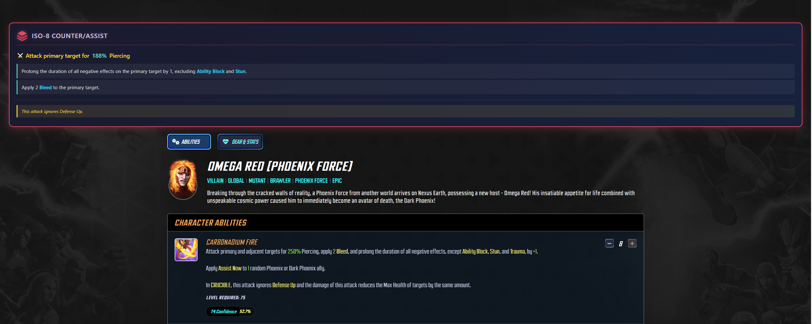

# MSF ISO-8 Counter/Assist Viewer

A Chrome extension that displays ISO-8 Counter Attack/Assist ability information on Marvel Strike Force character pages.

## Features

- **Automated Data Updates:** Fetches the latest game data remotely, so you always have current stats without reinstalling.
- **Context Awareness:** Automatically displays ISO-8 Counter/Assist ability info when viewing character pages.
- **Smart Formatting:** Shows damage percentages, piercing values, and highlights key effects.
- **Game Mode Styling:** Special color-coding for WAR, RAID, and CRUCIBLE-specific bonuses.
- **Dynamic Navigation:** Works seamlessly with the site's navigation (SPA) without page reloads.
- **Localization:** Translates the Counter/Assist panel into 8 languages using Scopely's official phrasing patterns. Sentence-level templates produce natural, grammatically correct descriptions — not just word-for-word replacements. Currently fully translated for Sersi, with more characters coming soon.
- **Global Support:** Automatically detects the site language from the URL and displays the panel in the matching language.
- **Dismissible:** Includes a close button to hide the panel when not needed.

## Screenshot



*Example showing ISO-8 Counter/Assist information for Omega Red (Phoenix Force)*

## Installation

### Step 1: Download the Extension

**Option A: Download from GitHub Releases (Recommended)**
1. Go to the [Releases page](https://github.com/netsecprogrammer/msf-iso8-chrome-extension/releases/latest)
2. Download the `msf-iso8-extension-v*.zip` file
3. Extract the zip file to a folder on your computer (e.g., `C:\Extensions\msf-iso8-chrome-extension`)
4. Remember this folder location - you'll need it in Step 2

**Option B: Clone the Repository**
```bash
git clone https://github.com/netsecprogrammer/msf-iso8-chrome-extension.git
```

### Step 2: Install in Chrome

1. Open Chrome and type `chrome://extensions/` in the address bar, then press Enter
2. Enable **Developer mode** by clicking the toggle switch in the top right corner

   

3. Click the **Load unpacked** button that appears after enabling Developer mode
4. In the file browser that opens, navigate to the folder where you extracted/cloned the extension
5. Select the folder and click **Select Folder**
6. The extension should now appear in your extensions list with the ISO-8 icon

### Step 3: Verify Installation

1. Look for "MSF ISO-8 Counter/Assist Viewer" in your extensions list
2. Make sure the toggle switch next to it is enabled (blue)
3. You should see the extension icon in your Chrome toolbar (you may need to click the puzzle piece icon to pin it)

## Usage

1. Navigate to https://marvelstrikeforce.com/*/characters/ (any language)
2. Click on any character (e.g., Red Guardian)
3. The ISO-8 Counter/Assist panel will automatically appear at the top of the content area.
4. Click the "×" button in the top-right corner to close the panel if needed.

## Architecture & Data

- **Remote Data:** The extension fetches character data from `iso8_data.json` on the `master` branch of this repository.
- **Caching:** Data is cached locally in your browser for 24 hours to ensure fast loading and offline support.
- **Security:** Strict Content Security Policy (CSP) ensures only trusted data from this repository is loaded.

## Supported Languages

| Language | URL Path | Panel Title |
|----------|----------|-------------|
| English | `/en/` | ISO-8 Counter/Assist |
| French | `/fr/` | ISO-8 Contre/Appui |
| German | `/de/` | ISO-8 Konter/Assist |
| Spanish | `/es/` | ISO-8 Contra/Asistencia |
| Portuguese | `/pt/` | ISO-8 Contra/Assistência |
| Italian | `/it/` | ISO-8 Contro/Assistenza |
| Japanese | `/ja/` | ISO-8 カウンター/アシスト |
| Korean | `/ko/` | ISO-8 반격/지원 |
| Russian | `/ru/` | ISO-8 Контратака/Помощь |

## Files

| File | Description |
|------|-------------|
| `manifest.json` | Chrome extension configuration (V3) |
| `content.js` | Content script (fetches data, injects panel, localization templates) |
| `iso8_data.json` | Remote source of truth for character stats |
| `locales.json` | Translation dictionary for proc names, trait names, and status effects |
| `styles.css` | Styling for the info panel |
| `icon48.png` | Small extension icon |
| `icon128.png` | Large extension icon |

## Troubleshooting

### Panel not appearing
- Make sure you're on a character page URL matching `.../characters/[CharacterName]`
- Try refreshing the page.
- Check if the extension is enabled in `chrome://extensions/`.

### "No Data Found"
- The extension uses fuzzy matching to find characters even if the URL name differs slightly from the internal ID.
- If data is truly missing, the panel will display a "No data found" message.

## Updating Data

To update with new game data:
1.  Obtain the latest game data folder (e.g., from an APK extraction).
2.  Edit `extract_iso8.js` to point to the `characters.json` file in your game data folder (absolute path).
3.  Run the extraction script:
    ```bash
    node extract_iso8.js
    ```
4.  Commit the updated `iso8_data.json` and push to GitHub.
5.  Users will receive the update automatically within 24 hours.

## Privacy

This extension does not collect, store, or transmit any user data. See [PRIVACY.md](PRIVACY.md) for details.

## License

This extension is for personal use with Marvel Strike Force data research.

---

*Updated February 2026*
